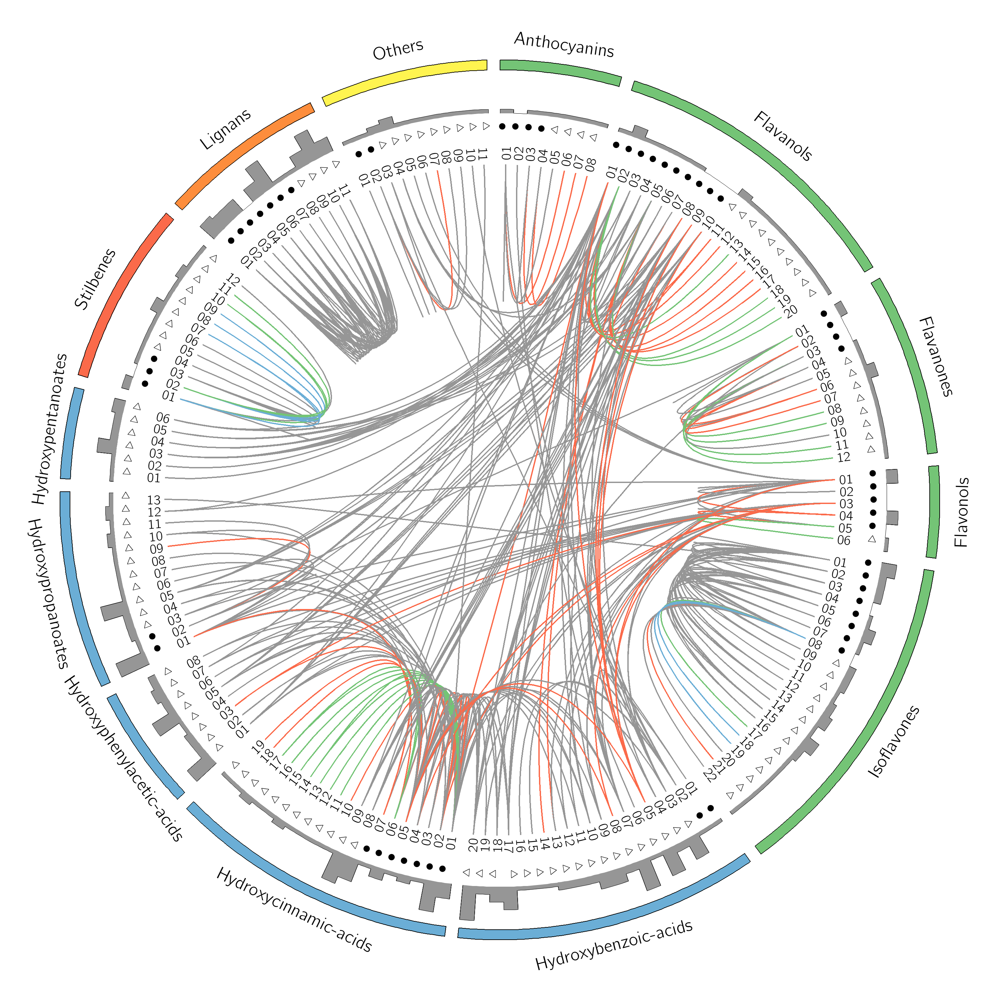
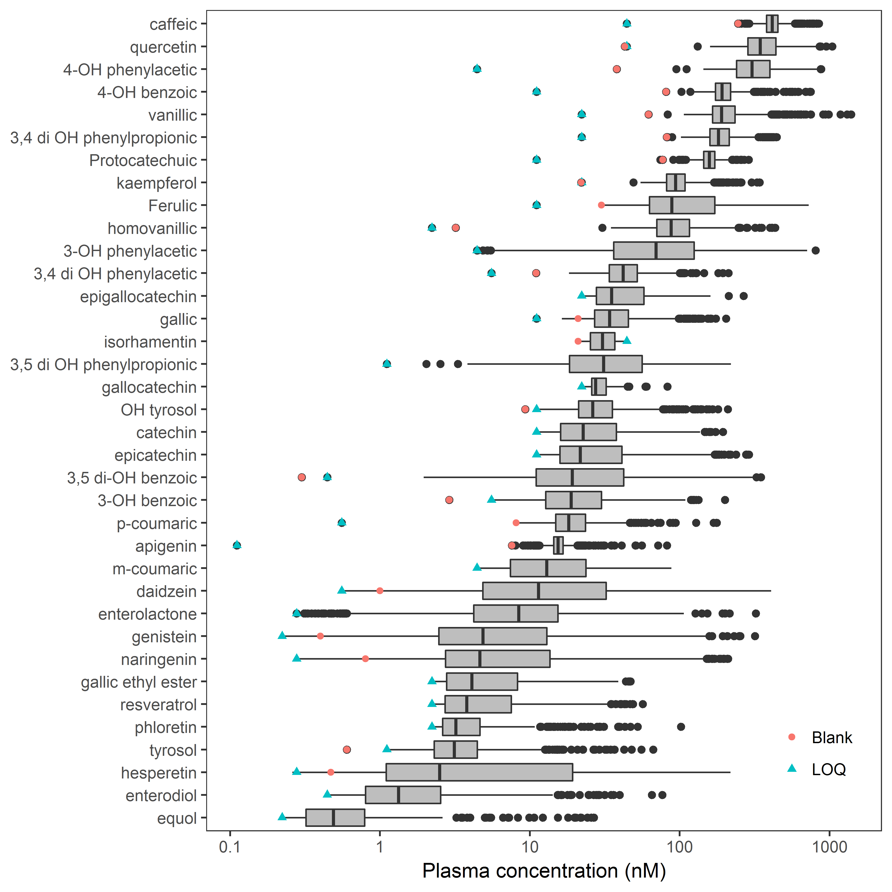

# Polyphenols projects
This repository contains scripts for the analysis of the Phenol-Explorer database and of polyphenol metabolite measurements in blood and urine in cohort studies.
Polyphenols projects are as follows:

1. Analysis of metabolism data from Phenol-Explorer
2. Analysis of retention factor data from Phenol-Explorer
3. Polyphenol metabolite profiles in blood and urine

_Interconversion in vivo of dietary polyphenols metabolised to conjugates or simpler compounds, from data collated in the *Phenol-Explorer* database._ 

_Boxplot of polyphenol metabolite concentrations in plasma as measured by LC-MS._
